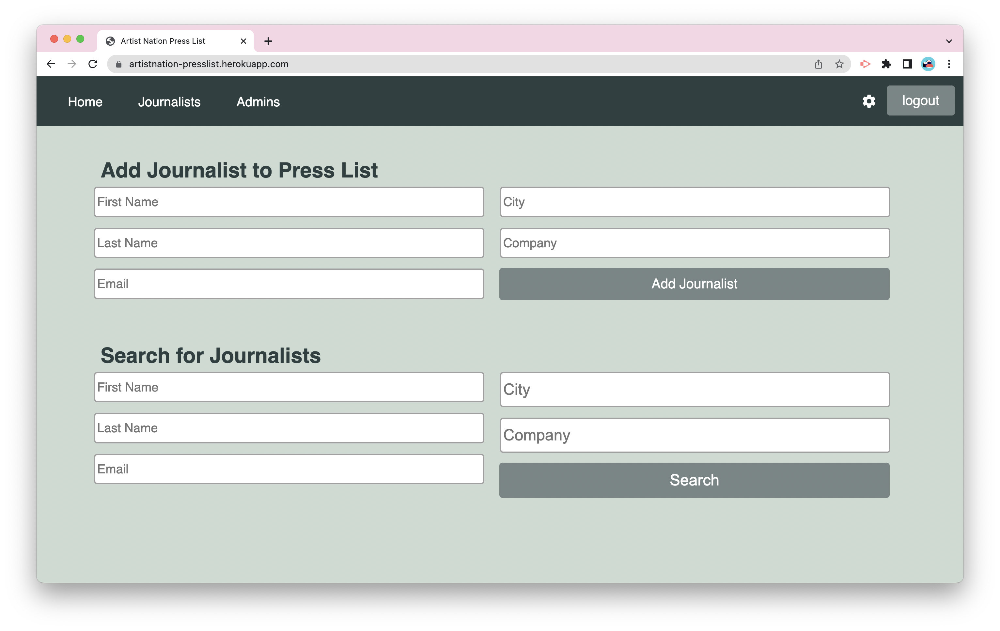

# Artist Nation Press List


## Description

This project is a full-stack application for Artist Nation to comprise and manage a press list. The application follows the MVC paradigm structure and is written in Javascript. It uses express to create a RESTful API for the controllers. MySQL along with sequelize ORM are used for the models. And Handlebars as a templating engine for the views. Express sessions and connect session sequelize packages are used to add authentication. Dotenv package used to store environment variables. Bcrypt package is used to hash passwords. Casual package is used to seed fake data.

  <br>

## Table of Contents

- [Installation](#installation)
- [Usage](#usage)
- [License](#license)
- [Deployed Link](#deployed-link)

  <br>

## Installation

Use the following command to download dependencies for the project:

```
npm install
```

Use the following command to seed the database:

```
npm run seeds
```

  <br>

## Usage


</br>
The application allows admins the ability to login and manage a press list. Once logged in, on the homepage admins have the ability to add a journalist to the press list. They have the option to search the press list based on first name, last name, company, email and or city, with an auto-complete feature for each field, or they can view all the journalist using the journalist tab. The entire press list or the refined searched press list can be sorted in ascending order by all categories and give the option to email a single journalist, or all of the journalist listed through their email browser. There is a settings feature for the admin to change their username and password, and a single designated admin has the option to manage other admins, with ability to add and delete other admins.
</br>

## License

This project is licensed under the [MIT License](https://choosealicense.com/licenses/mit/).  
 </br>

## Deployed Link

https://artistnation-presslist.herokuapp.com/
</br>
